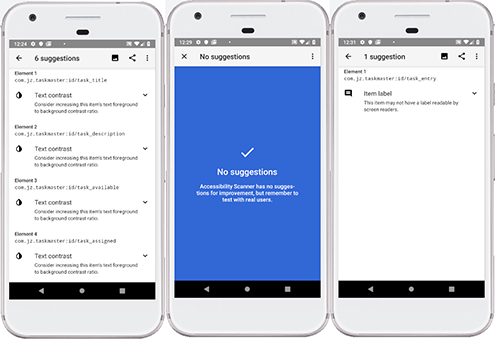

# TaskMaster

This app will allow users to track tasks on a project. 

## Day One Features

1. User Tasks should be displayed in a RecyclerView with a ViewAdapter.
2. Users should be able to click on one task to view an activity with detailed task info.
3. Users should be able to create a Task with a title, description, and state (Available, Assigned, Accepted, or Finished).
4. Task data should be persisted with the Cloud Firestore.
5. Test the ViewAdapter. 

## Day Two Features

1. Users should be able to log in with email and password.
2. Users should be able to see all tasks in the database.
3. Users should be able to assign a task to themselves.
4. The user assigned to a task should be able to accept and mark the task as complete. 

## Day Three Features

1. Users should be able to visit a "My Task" page.
2. The My Task page should display all current tasks in a RecyclerView.
3. Users should be able to filter their tasks by "open" and "all". 

## Day Four Features

1. Users should have a Profile Page. 
2. On that activity, users should be able to view and edit their username and bio.
3. On the Task detail activity, clicking on the assigned user should open that user's profile.

## Day Five Features

1. User's device tokens should be saved in their profile.
2. The notifications composer should be able to send notifications to all devices with the app.

## Day Six Features

1. Add notification to users when a task's state is updated.
2. Everyone who has interacted with that task should be notified. 
3. The notification should include the task title and state. 
4. Tapping the notification should take the user to that task's detail page. 

## Day Seven Features

1. Ensure the app is accessible to all users. 
2. Test using TalkBack and the Accessibility Scanner.
3. Enable AccessibilityChecks on Espresso tests.
4. Share Results of Scanner test:

 

## References

<a href="https://firebase.google.com/docs/firestore/quickstart">Cloud Firestore Docs</a>

<a href="https://github.com/codefellows/seattle-java-401d3">Java 401 Class Demos</a> 

<a href="https://firebase.google.com/docs/functions/get-started">Firebase Function Docs</a>

<a href="https://developer.android.com/topic/libraries/data-binding/observability#samples">Android Dev Guide</a>
